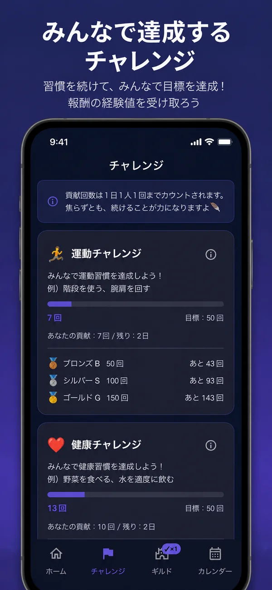
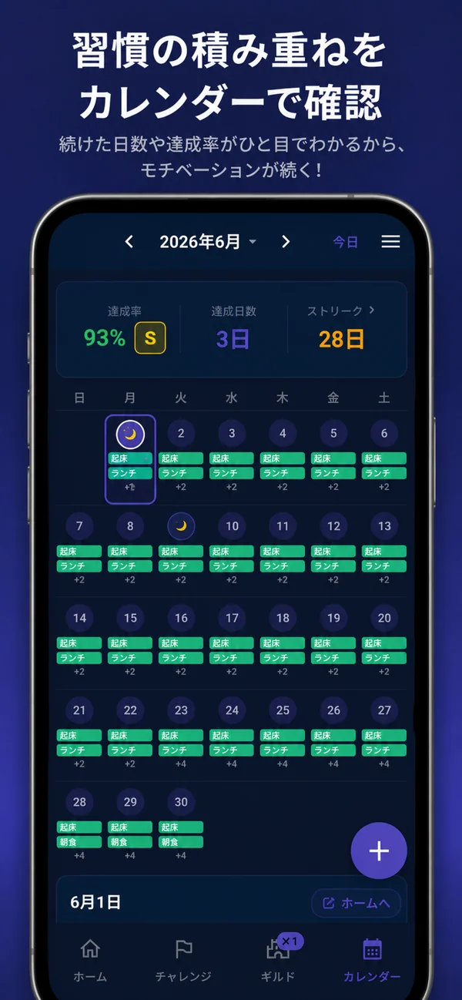
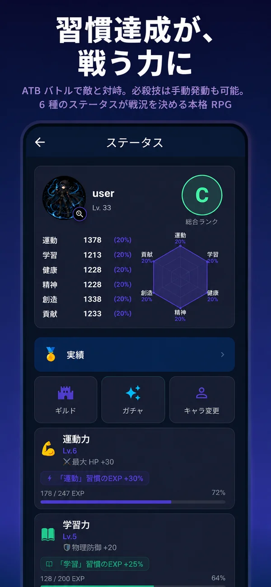
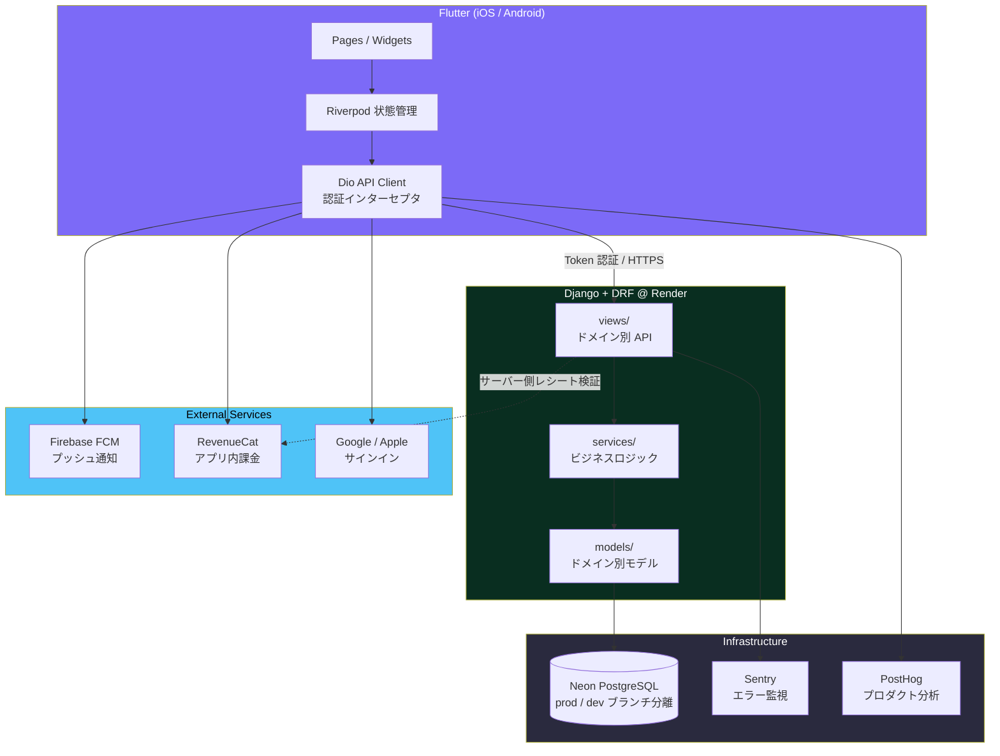

<div align="center">

# 🦉 Sabiowl

**休んでも壊れない習慣化アプリ**

RPG の成長要素で継続を支える習慣管理アプリ。<br>
「連続記録を切らした瞬間に終わった気持ちになる」という習慣アプリ共通の失敗を、設計で解消することを狙ったプロダクトです。

[](https://github.com/sabiowl/sabiowl-portfolio/actions/workflows/ci.yml)


**個人開発 / 企画・設計・実装・リリース・運用まで一人で担当**<br>
2026-04 開発開始 → **2026-07-04 App Store リリース** → 以降 **8 回のアップデートを運用中**（v1.1.3 は審査中）

</div>

---

> **このリポジトリについて**
> 開発は非公開リポジトリで行っており、これはその**公開用スナップショット**です。
> 本番インフラの識別子・審査対応の記録・障害対応手順を含む運用文書は除外しています。
> そのためコミット履歴はリリース単位の粒度になっています。
> 除外の判断基準と、公開前に走る秘密走査の仕組みは
> [DESIGN_DECISIONS.md](doc/DESIGN_DECISIONS.md) に記載しています。

---

## 📱 スクリーンショット

| ホーム | チャレンジ | ギルド |
|:---:|:---:|:---:|
|  |  |  |

| バトル | カレンダー | ステータス |
|:---:|:---:|:---:|
|  |  |  |

---

## なぜ作ったか

習慣化アプリの多くは **「ユーザーを押す」** 設計になっています。連続記録を強調し、途切れると赤くなり、通知で急かす。しかしこの設計は、**一度つまずいたユーザーを最も強く離脱させます。**

Sabiowl は逆張りをしました。

| 一般的な習慣アプリ | Sabiowl |
|---|---|
| 連続記録が途切れる = 失敗状態 | 途切れても **積み上げたステータスは減らない**（減衰・ペナルティの経路を実装していない） |
| 通知で行動を急かす | マスコット「サビ」は励まさず、命令せず、ただ気づく |
| 記録が数字の羅列で終わる | 習慣が **6 軸ステータス**（運動力/学習力/健康力/精神力/創造力/貢献力）に変換され、キャラクターが強くなる |

継続の報酬を「連続記録の維持」ではなく **「積み上がった自分の可視化」** に置き換えることで、途切れても戻ってこられる構造を狙っています。

> Sabi is **not a mentor. Not a coach. Not a cheerleader.**<br>
> Sabi is **a quiet sanctuary that affirms who you already are.**

キャラクターの口調・世界観・NPC の役割分担まで仕様として明文化し、**英語版のトーン逸脱を CI で検出する**ところまで実装しています。

> **現状の未達**: 「休息を肯定する」という主張に対し、ユーザーが能動的に「今日は休む」と宣言する機能は**現在ありません**。休息日機能は UI 動線が無いまま自動消費専用になっていたため撤去し（FEAT-424）、現在残っているのは途切れた後に使う「ストリークの石」だけです。ポジショニングと体験設計のズレとして認識しています。

---

## 📊 プロジェクト規模（実測値）

| 項目 | 値 |
|---|---|
| 開発期間 | 2026-04-14 〜 継続中（約 5.5 ヶ月） |
| コミット数 | **1,903** |
| Backend LOC | **71,160**（`api/` + `config/`。うち migration 13,004 / テスト 29,685）|
| Mobile LOC | **104,261**（`lib/`。うち自動生成 20,646 — 大半は l10n の 19,659）|
| DB マイグレーション | **207 本**（最新 `0207_feat544_mandatory_update_copy`）|
| Backend テスト | **1,043 ケース** / 129 ファイル |
| Flutter テスト | **944 ケース** / 119 ファイル |
| 画面数（`GoRoute` 定義） | **44** |
| リリース | v1.0.0 〜 **v1.1.2**（8 回のアップデート。**v1.1.3 は審査中**） |

> 数値は 2026-09-27 実測。LOC は空行・コメントを含む素の行数で、`cloc` 等の除外は行っていません。

---

## 🏗 アーキテクチャ



### レイヤ設計の方針

Django で肥大化しがちな `views.py` / `models.py` を、**ドメイン別ディレクトリ + サービス層**へ分割する方針で移行を進めています。

```
backend/api/
├── views/        # HTTP 境界。リクエスト検証 → service 呼び出し → レスポンス整形
│   ├── battle/  habits.py  gacha.py  shop.py  social.py ...
├── services/     # ビジネスロジック。トランザクション境界はここ
│   ├── exp_service.py            # EXP 計算・6 軸ステータス按分
│   ├── habit_slot_service.py     # Legendary スロット解放条件
│   ├── challenge_reward_service.py
│   └── diamond_service.py        # 課金通貨の増減（冪等性担保）
├── models/       # ドメイン別モデル定義
└── tests/        # 102 ファイル / 682 ケース
```

**ただし、この分離はまだ全体に行き渡っていません。** `views/` 38 ファイルのうち `services/` を利用しているのは 16 ファイル（42%）で、ショップ購入・バトル開始といった**最も複雑な経路ほど view にロジックが残っています**（最大 306 行）。返済予定のある技術的負債として、実測値と優先順位を [ARCHITECTURE.md §2.3](doc/ARCHITECTURE.md) に明記しています。

直近では最大だった `battle/finish.py` の `post()` を 426 → 256 行に縮めました。先に characterization test 22 ケースで現行挙動を固定してから抽出しており、エラーコード・文言・検証順序まで変えていないことを検証済みです。

Flutter 側は **feature-first** 構成で、`core/`（API クライアント・ルーター・テーマ）と `features/`（機能単位）を分離しています。

📖 **詳細 → [doc/ARCHITECTURE.md](doc/ARCHITECTURE.md)**

---

## 🛠 技術スタック

| 領域 | 技術 | 選定理由 |
|---|---|---|
| **Mobile** | Flutter 3.29.3 / Dart 3.7.2 | iOS/Android 同時展開を個人開発の工数で成立させるため |
| | Riverpod 2.6 + riverpod_generator | コード生成による型安全な `family` / 自動 `autoDispose` |
| | go_router 14.8 | ShellRoute によるボトムナビ + ディープリンク対応 |
| | freezed / json_serializable | API レスポンスの不変モデル化とパースの安全性 |
| **Backend** | Django 6.0 + DRF | 管理画面・ORM・マイグレーションが標準装備で個人開発と相性が良い |
| | PostgreSQL (Neon) | DB ブランチ機能で prod のスナップショットから dev 環境を分離 |
| | DRF TokenAuthentication | Google / Apple サインイン + ゲストモードの 2 経路を統一的に扱う |
| | Firebase Admin SDK | FCM 送信 / アカウント削除時の Firebase Auth 連動 |
| **Infra / CI** | Render (Singapore) | prod / dev の 2 環境を Blueprint + Dashboard で分離運用 |
| | GitHub Actions | Django テスト + flutter analyze + flutter test + pre-commit を **全て fatal** で実行 |
| | Codemagic | iOS ビルド 〜 TestFlight 配信の自動化 |
| | Sentry / PostHog | クラッシュ監視とプロダクト分析（セッションリプレイは無効化） |

---

## 🎯 技術的な見どころ

### 1. CI を「敷いた」のではなく「締めていった」

初期は `flutter analyze` を `continue-on-error: true` で運用し、baseline の 13-15 issues を許容していました。それを段階的に潰し、**2026-07-25 に全 job を fatal 化**。[ci.yml](.github/workflows/ci.yml) には移行の意図と経緯がコメントとして残っています。

さらに **プロダクト固有の lint を pre-commit で自作**しています。

```yaml
- id: no-raw-exception-in-ui     # UI の Text に生の例外を出さない
- id: no-raw-error-tostring      # e.toString() をユーザーに見せない
```

これは「ユーザーに技術的なエラー文字列を見せない」というプロダクト原則を、**レビューではなく仕組みで守る**ための実装です。

### 2. トランザクション設計と並行性制御

課金通貨・ガチャ・EXP など、**不整合が実害に直結する処理**にロック順序の規約を設けています。

- 複数の `CharacterStat` を更新する箇所は `select_for_update()` を **pk 昇順**で取得し、デッドロックを構造的に排除
- `@transaction.atomic` 内で `IntegrityError` を捕捉する際は **入れ子 savepoint 必須**。PostgreSQL の aborted transaction による 500 エラーを本番で踏んだ後にルール化しました（BUG-67）

### 3. 破壊的マイグレーションの禁止と、その例外条項

本番 DB を壊さないため、**`RunPython` での `.delete()` / 大量 `update()` を原則禁止**し、management command での明示的な手動実行に寄せています。

一方で「禁止だけでは回らないケース」（master data 投入等）が実在したため、**例外条項を 3 条件付きで明文化**しました（対象は master data のみ / FK 網羅 / 冪等性）。ルールを絶対化せず、**例外の境界を定義する**アプローチを取っています。

（マイグレーション運用の詳細ルールは非公開ドキュメントに記載）

### 4. 障害を「再発防止の仕組み」に変換する

本番障害・実装事故を都度ポストモーテム化し、**チェックリストやルールに落として文書化**しています。

| 起きた事故 | 仕組みへの変換 |
|---|---|
| `transaction.atomic` の入れ子漏れで本番 500 | nested savepoint パターンをルール化 + 契約テスト追加 |
| ローカルから本番 DB への誤 migrate | ローカル `.env` に `DATABASE_URL` を書かない運用 + 接続先の安全確認スクリプト |
| dialog を閉じながら遷移して黒画面化 | dialog の close と navigation を分離する規約（BUG-65） |

（ポストモーテムは非公開ドキュメントに記載）

### 5. 品質指標の自己計測（DORA メトリクス）

個人開発でも客観的に自己評価するため、DORA 4 指標で計測しています。

| 指標 | 現状 | Elite 水準 |
|---|---|---|
| Deployment Frequency | 約 5 回/日 | 複数回/日 ✅ |
| Lead Time for Changes | 約 10 分 | < 1 時間 ✅ |
| **Change Failure Rate** | **約 25%** | < 15% ⚠️ **改善中** |
| Mean Time to Recovery | 約 1-2 時間 | < 1 時間 ✅ |

CFR が目標未達であることを認識し、**Pre-mortem の義務化**（中規模以上の実装では「失敗するとしたら何が原因か」を着手前に 3-5 個列挙する）を対策として導入しています。

### 6. 国際化（実装完了 / 配信は判断で保留中）

日本語 / 英語の 2 言語対応は **実装を完了しています**。ARB による文言管理に加え、**キャラクターの口調が翻訳で崩れないことを CI でガード**しています。

- ARB 網羅ガード（空値検出 / ja-en 一致検出。現在 ja / en 各 1,520 キー、欠落 0）
- ICU plural の `=1` / `other` 契約テスト
- **英語版サビ / リリアのトーン逸脱を検出する CI テスト**
- API エラーコードのロケール解決（サーバーは `code` を返し、クライアントが文言を解決）
- 公式サイト（利用規約・プライバシーポリシー・FAQ・使い方）の英語版と、ロケール別 URL 解決

**ただし App Store の英語圏への配信は、まだ行っていません。**

配信条件として自分で定めた 4 項目（Sentry のセッション数 / crash-free 率 99.5% 以上 / P0 バグゼロ / α テストの反映）は **2026-09-23 に全て満たしました**。そのうえで配信を止めています。理由は、**情報設計の作り直しに着手しており、その最中に英語圏の運用を足すとどちらも中途半端になる**と判断したためです。

**技術的な未完成ではなく、時期の判断です。** 判断の根拠と「どの改修が終わったら開けるか」の定義は、リリースチェックリストに記録して追跡しています。

---

## 🤖 AI を前提とした開発プロセス

本プロジェクトは **Claude Code を全面的に活用**して開発しています。ただし「AI に書かせた」のではなく、**AI の出力品質を仕組みで統制する設計**に開発時間の相当部分を投資しました。

### 統制の 3 レイヤ

| レイヤ | 実装 | 目的 |
|---|---|---|
| **1. 規約の外部化** | `CLAUDE.md`（非公開）/ [`DEVELOPER_STYLE_GUIDE.md`](DEVELOPER_STYLE_GUIDE.md) | プロジェクト固有ルールと普遍ルールを階層化し、矛盾時の優先順位まで定義 |
| **2. 機械的なガード** | pre-commit / strict CI / 契約テスト | AI が規約を破ってもマージされない |
| **3. プロセスの規律** | Pre-mortem 義務化 / 指示書とステータス管理 / セッション種別の分割 | 判断の質を人間側で担保する |

### 具体的に効いた設計

- **失敗パターンの明文化** — 実際に踏んだ落とし穴（dialog の遷移競合、`dispose()` 内 `setState`、正規表現一括置換の誤爆 等）をルール化し、同じ失敗を繰り返さない構造にした
- **レビュー品質のセルフガード** — AI レビューが過剰批判・誤診断に陥る構造的バイアスを分析し、チェックリスト化。「grep ヒット = バグ」と短絡しない、documented gap を hidden bug と呼ばない、等
- **「真実値」の一元化** — 同じ情報が複数箇所にある場合、どのファイルが正なのかを必ず明記し、ドキュメントの腐敗を防ぐ

📖 **詳細 → [doc/AI_WORKFLOW.md](doc/AI_WORKFLOW.md)**

---

## 📂 リポジトリ構成

```
sabiowl/
├── backend/                  # Django + DRF
│   ├── api/
│   │   ├── views/            # ドメイン別 API（HTTP 境界）
│   │   ├── services/         # ビジネスロジック
│   │   ├── models/           # ドメイン別モデル
│   │   ├── migrations/       # 200 本
│   │   └── tests/            # 682 ケース
│   └── config/settings.py
├── mobile/                   # Flutter
│   ├── lib/
│   │   ├── core/             # API クライアント / ルーター / テーマ
│   │   ├── features/         # 機能単位（habits / gamification / calendar / social ...）
│   │   ├── shared/           # 共通ウィジェット
│   │   └── l10n/             # ja / en
│   └── test/                 # 419 ケース
├── doc/                      # 設計・仕様（運用文書は非公開）
├── scripts/                  # 運用スクリプト
├── .github/workflows/        # CI
└── DEVELOPER_STYLE_GUIDE.md  # 普遍的な開発規律
```

---

## 🚀 ローカル環境構築

### Backend

```bash
cd backend
python -m venv venv && source venv/bin/activate   # Windows: venv\Scripts\activate
pip install -r requirements.txt
cp .env.example .env          # DATABASE_URL は未設定のままで SQLite にフォールバック
python manage.py migrate
python manage.py runserver
```

> **補足**: ローカル `.env` に `DATABASE_URL` を書かない運用です。本番 DB への誤操作を構造的に防ぐため、未設定時は SQLite にフォールバックします。

### Mobile

> **注**: Firebase の生成設定（`google-services.json` / `GoogleService-Info.plist` /
> `firebase_options_*.dart`）は公開リポジトリから除外しているため、
> このスナップショットはそのままではビルドできません。

```bash
cd mobile
flutter pub get
dart run build_runner build --delete-conflicting-outputs
flutter run --dart-define=API_BASE_URL=http://localhost:8000/api
```

### テスト

```bash
cd backend && python manage.py test api      # 682 ケース
cd mobile  && flutter test                   # 419 ケース
cd mobile  && flutter analyze --no-fatal-infos
```

---

## 📄 ドキュメント

| ドキュメント | 内容 |
|---|---|
| [ARCHITECTURE.md](doc/ARCHITECTURE.md) | システム構成・データモデル・レイヤ設計 |
| [DESIGN_DECISIONS.md](doc/DESIGN_DECISIONS.md) | 技術選定と設計判断の記録（課題 → 選択肢 → 判断 → 結果） |
| [AI_WORKFLOW.md](doc/AI_WORKFLOW.md) | AI を統制する開発プロセスの設計 |
| [DEVELOPER_STYLE_GUIDE.md](DEVELOPER_STYLE_GUIDE.md) | プロジェクト非依存の開発規律・失敗パターン集 |

---

<div align="center">

**Developed by Subaru Fujii**

</div>
