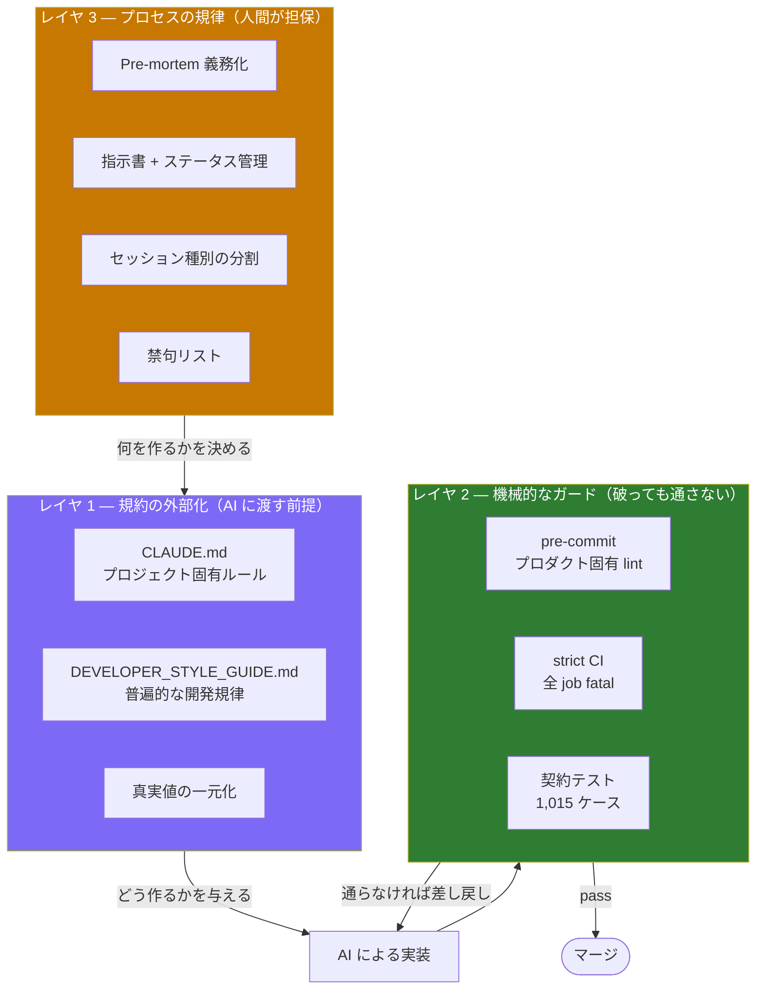

# Sabiowl — AI を前提とした開発プロセスの設計

> 最終更新: 2026-08-04
> 関連: [ARCHITECTURE.md](ARCHITECTURE.md) / [DESIGN_DECISIONS.md](DESIGN_DECISIONS.md)

---

## 0. この文書の主張

Sabiowl は Claude Code を全面的に活用して開発しています。しかし **「AI を使った」こと自体には価値がありません。** 2026 年時点では誰でも使えます。

価値があるのは次の点です。

> **AI の出力は速いが、品質は保証されない。**
> **保証されない前提で、品質を仕組みで担保する設計に開発時間の相当部分を投資した。**

本ドキュメントは、その設計と、**実際に何が防げて何が防げなかったか**の記録です。

---

## 1. 前提: AI 活用で実際に起きる問題

理論ではなく、本プロジェクトで**実測した**失敗です。

| 失敗モード | 具体例 | 発見経路 |
|---|---|---|
| **前提の誤りが高速に増幅される** | 誤った検索式で「移行完了」と判断 → 78 箇所の未移行を見逃す | 次フェーズ着手前の再確認 |
| **横断的作業での機械的な誤爆** | 正規表現による一括書き換えで 3 日間に欠陥 6 件 | 構文エラー / テスト失敗 |
| **既存の意図を「間違い」と誤読** | 意図的に残した旧実装を「移行し忘れ」と解釈 | コードレビュー |
| **レビュー時の過剰批判** | documented gap を "hidden bug" と断定 | 人間による反論 |
| **ドキュメントと実装の乖離** | ステータス管理表に、実装済みの項目が未着手のまま滞留（20 件） | 定期的な機械照合 |

これらに共通するのは、**「AI が悪い」のではなく「検証されない前提が下流に伝播する」構造**である点です。対策も構造で行う必要があります。

---

## 2. 統制の 3 レイヤ



**設計思想**: レイヤ 1 は「守ってほしいこと」、レイヤ 2 は「守らせること」です。**レイヤ 1 だけでは効きません。** 指示は無視されうるので、機械的に止める層が必ず要ります。

---

## 3. レイヤ 1 — 規約の外部化

### 3.1 2 文書の階層設計

規約を 2 つに分け、**それぞれの真実値の所在を明示**しています。

| 区分 | 真実値 | 内容 |
|---|---|---|
| プロジェクト非依存（普遍） | **`DEVELOPER_STYLE_GUIDE.md`** | 意思決定の優先順位 / セッション運用 / Pre-mortem 義務化 / 失敗パターン集 |
| Sabiowl 固有 | **`CLAUDE.md`** | キャラクターの口調 / 技術スタック詳細 / ゲームバランス定数 / デプロイ規則 |

**矛盾したときの優先順位も明記しています**（Sabiowl 固有 > 普遍）。これがないと、AI は矛盾に遭遇したときに勝手に一方を選びます。

分離の副次的な効果として、`DEVELOPER_STYLE_GUIDE.md` は**そのまま他プロジェクトに持ち出せます**。実際、別プロジェクト開始時のチェックリスト（§11）を含んでいます。

### 3.2 意思決定の優先順位を公式化する

「良い感じにして」では AI は判断できません。トレードオフの優先順位を明示しています。

```
動作の軽さ (C) = ストレスゼロ (A)  >  操作の楽しさ (B)  >  運用コストの低さ (D)
```

これにより、次のような判断が**議論なしで**決まります。

| 判断 | 適用 | 結論 |
|---|---|---|
| バトル演出 vs バッテリー消費 | B vs C | **C 優先** — 待機時は 10fps tick + `RepaintBoundary` で隔離 |
| Render 無料枠の 60 秒コールドスタート | C vs D | **C 優先** — ただしタイムアウト + サビ口調メッセージで体感を緩和 |
| リリース 5 週前の Backend 構造変更 | D vs リスク | **リスク優先** — 触らず v1.1 へ送る |

### 3.3 「真実値」を必ず 1 箇所に定める

同じ情報が複数箇所にある場合、**どのファイルが正なのかを必ず書く**運用にしています。

```python
# 真実値: backend/api/services/habit_slot_service.py:calc_legendary_slots()
```

これがないと、AI は古い方のドキュメントを参照して実装します。**ドキュメントが増えるほど、この明示が効きます。**

### 3.4 「やらない」判断を書く

規約には禁止事項だけでなく、**意図的にやっていないこと**も書いています。

> 既存の手動プロバイダー feature（`social` / `settings` / ...）は**移行しない**。

これを書かないと、AI は「移行し忘れ」と判断して、動いているコードを触ります。

---

## 4. レイヤ 2 — 機械的なガード

規約は破られる前提で、**破ってもマージされない**層を作ります。

### 4.1 プロダクト固有の lint を自作する

汎用 linter は「ユーザーに技術的なエラー文字列を見せない」というプロダクト原則を知りません。そこで `pre-commit` で自作しました。

```yaml
- id: no-raw-exception-in-ui     # Text('$e') 等の生例外の UI 展開を検出
- id: no-raw-error-tostring      # $e.toString() の UI 漏洩を検出
```

意図的に例外を表示したい箇所は `// ignore: raw_exception` で抑制できます。**抑制手段を用意しないと、ルールごと外されます。**

> **この lint 自体も一度失敗しています。** 初版の正規表現 `Text.*\$e` が `$expGain` `$error` `$element` にもマッチして CI を赤くしました。単語境界 `\b` を追加して修正済みです。**ガードを書くときもガードが要る**という教訓です。

### 4.2 CI をすべて fatal にする

| job | 内容 |
|---|---|
| `backend-test` | Django テスト 682 ケース（**PostgreSQL 上で実行**） |
| `flutter-test` | `pre-commit` + `flutter analyze` + Flutter テスト 419 ケース |

`continue-on-error` は使っていません。`flutter analyze` のみ `--no-fatal-infos` で info を許容していますが、**その緩和の解除条件も設定ファイルに書いています**。

CI を PostgreSQL で実行しているのは、ローカルの SQLite では再現しない不具合（トランザクションの aborted 状態など）を捕まえるためです。

### 4.3 契約テストで仕様を縛る

合計 **1,015 ケース**（Backend 636 + Flutter 379）。特徴的なのは、**AI が壊しやすい箇所を狙って縛っている**点です。

| 対象 | テスト例 |
|---|---|
| API のエラー形式 | `test_error_response_format.py` — 新形式に統一されているか |
| エラーコードの多言語対応 | `test_error_code_l10n_sync.py` — code と文言の対応漏れ検出 |
| **キャラクターの口調** | 英語版のトーン逸脱を CI で検出 |
| 多言語リソースの網羅 | ARB の空値検出 / ja-en の同一文字列検出 |
| ゲームバランス | 敵のステータス表・報酬テーブルの回帰防止 |

「キャラクターの口調を CI でテストする」のは奇妙に見えますが、**多言語化の過程で実際に逸脱が発生した**ため追加しました。

---

## 5. レイヤ 3 — プロセスの規律

機械では担保できない「判断の質」を人間側で保つ仕組みです。

### 5.1 Pre-mortem の義務化

中規模以上の実装では、着手前に **「この実装が失敗するとしたら何が原因か」を 3〜5 個** 書きます。

| 規模 | Pre-mortem |
|---|---|
| 🟢 軽量（30 分以内 / 単一ファイル） | 不要 |
| 🟡 中規模（〜2 時間 / 複数ファイル） | **必須（3 個以上）** |
| 🔴 大規模（半日以上 / migration を含む） | **必須（5 個以上 + 各シナリオに予防策）** |

想定すべきカテゴリを引き出しとして列挙しています（データ整合性 / 競合・race / 副作用の連鎖 / エッジケース / 権限・認証 / UX 摩擦 / 外部依存 / 回帰 / 運用）。

**効果**: リリースブロッカー級の不具合の多くは「実装前に想像力を働かせていれば検出できた」ものでした。Pre-mortem は事後の post-mortem と対をなす**事前の想像力テスト**です。

### 5.2 指示書とステータスの二重管理

600 件の指示書（`FEAT-XXX` / `BUG-XXX`）を運用しています。

| タイミング | 操作 |
|---|---|
| 起票時 | ステータス一覧に追加 + 個別ヘッダーを「🔴 未着手」 |
| 着手時 | 個別ヘッダーを「🟡 実装中」 |
| 完了時 | 「✅ 実装済み」+ **コミット ID を記載** + 一覧を更新 |

> **この運用は一度破綻しました。** 2026-08-04 の棚卸しで、**未完了とされていた 43 件のうち 20 件が実は実装済み**でした。見かけ上「未着手 25 時間分」あったものが、実際には存在しませんでした。
>
> ステータス表は工数見積もりの基礎データなので、ここが狂うと計画全体が狂います。**定期的に `git log` と機械照合する**運用を追加しました。

### 5.3 セッションを目的別に切る

長時間の連続セッションは、文脈が肥大化して判断の質が落ちます。目的別に分割しています。

| 種別 | 主タスク | 目安 |
|---|---|---|
| PM（要件） | 要件整理・指示書起票・判断保留の解決 | 〜3 時間 |
| PM（実装） | 軽量な修正・検証案内・コミット案提示 | 〜3 時間 |
| PM（リリース準備） | ストアアセット・法務文書・ビルド・提出 | 〜半日 |
| PM（長期設計） | アーキテクチャ・ロードマップ | 〜半日 |
| Develop | 指示書に基づく実装 | タスク単位 |

**切り替えのトリガー**: 主タスクが別カテゴリに移る / 検証とコミットで 1 ユニット閉じた / 応答が遅くなってきた / 累計 4-5 時間超。

### 5.4 禁句リストで判断のブレを止める

リリース前のスコープ凍結後、次の発言を**禁句**として定義しました。

> 「もう少し作り込めば」「nice-to-have だけど」「ついでに」

該当する発言が出たら、**即座に次バージョンの指示書として起票**します。判断を否定するのではなく、**記録して先送りする**ことで議論を終わらせる仕組みです。

### 5.5 レビュー品質のセルフガード

AI にコードレビューをさせると、**過剰批判・誤診断に系統的に偏る**ことが分かりました。「妥協のない評価をせよ」というプロンプトが、批判を作り出す方向に働くためです。

実際に出した誤判定を分析し、チェックリスト化しています。

| 罠 | 対策 |
|---|---|
| grep ヒットを読まずにバグと断定 | grep は存在確認のみ。**必ず該当箇所を読んでから**判定する |
| documented gap を "hidden bug" と呼ぶ | 「v1.1 で対応予定」と書かれていれば**意思決定の記録**。言葉を選ぶ |
| 「リリースブロッカー」の乱用 | 致命バグ / クラッシュ / 機能不全のみ。**P0 は 3 件以下**に絞る |
| 数値だけで UX を批判 | 「待ち時間 100 秒」の**間にユーザーが何をできるか**を確認してから書く |
| 定数の変更を提案する前に経緯を読まない | その定数の**コメントと変更履歴**を読む |

**提出前のセルフチェック**として、「ポジティブな発見を最低 3 件書いたか（批判のための批判を避ける）」という項目も入れています。

---

## 6. 実際に効いたか — 正直な評価

### 効いたもの

| 施策 | 根拠 |
|---|---|
| **CI の fatal 化** | 導入後、退行がマージされた事例なし |
| **契約テスト** | 多言語化のような横断作業で、口調逸脱・リソース漏れを機械検出 |
| **「やらない」判断の明文化** | 動いているコードへの不要な変更が止まった |
| **Pre-mortem** | 大規模変更（モデル 4 分割・DB 移行）が本番影響ゼロで完了 |

### 効かなかった / 破綻したもの

| 施策 | 何が起きたか |
|---|---|
| **ステータスの二重管理** | 手動更新が追いつかず、43 件中 20 件が実態とずれた（→ 機械照合を追加） |
| **規約の量** | 規約文書が肥大化（`CLAUDE.md` 71KB）。全部は読まれない前提で、**常時適用する Top N を冒頭に置き、詳細をサブ文書に分割**する再編を実施 |
| **一括書き換えのガード** | そもそもガードが存在しなかった。3 日間で欠陥 6 件を作り込んだ後に規約化（→ [DESIGN_DECISIONS §11](DESIGN_DECISIONS.md#11-正規表現による一括書き換えをやめた)） |

### 数字で見た現状

DORA メトリクスで自己計測しています。

| 指標 | 現状 | Elite 水準 | 評価 |
|---|---|---|---|
| Deployment Frequency | 約 5 回/日 | 複数回/日 | ✅ |
| Lead Time for Changes | 約 10 分 | < 1 時間 | ✅ |
| **Change Failure Rate** | **約 25%** | < 15% | ⚠️ **未達** |
| Mean Time to Recovery | 約 1-2 時間 | < 1 時間 | ✅ ほぼ |

**CFR が明確に未達です。** 「速く出す」は達成できていますが、「壊さずに出す」は道半ばです。

AI 活用は Deployment Frequency と Lead Time を劇的に改善しますが、**Change Failure Rate は自動的には下がりません**。むしろ変更量が増える分、統制がなければ悪化します。本ドキュメントの施策は、この CFR を下げるための投資です。

---

## 7. 他プロジェクトへ転用するなら

コストと効果で並べると、優先順位は明確です。

| 優先 | 施策 | コスト | 効果 |
|---|---|---|---|
| **1** | **CI を最初から fatal で入れる** | 低 | 最大。後から締めるのは常に難しい |
| **2** | **意思決定の優先順位を 1 行で定義する** | 低 | 判断のブレが消える |
| **3** | **真実値の所在を必ず書く** | 極小 | ドキュメント腐敗の予防 |
| **4** | 一括書き換え後の構文検証を無条件実行 | 極小 | 実測で欠陥 6 件中 3 件を防げた |
| **5** | Pre-mortem（中規模以上） | 中 | 大規模変更の事故率が下がる |
| **6** | 契約テストで「壊れやすい箇所」を縛る | 中 | 横断的作業で効く |
| 7 | ステータス管理 | 高 | **機械照合とセットでないと破綻する** |

`DEVELOPER_STYLE_GUIDE.md` の §11 に「別プロジェクト開始時のチェックリスト」として、この転用手順をまとめています。

---

## 8. 結論

AI を使った開発で本質的に変わるのは、**開発速度ではなく「検証のボトルネックがどこに移るか」**でした。

- 実装は速くなった
- **前提の妥当性を確認する作業がボトルネックになった**

「その検索式は本当に対象を捉えているか」「その変換は表現力を保つか」「その完了報告の根拠は何か」——これらは AI が高速に実行してくれる領域の**外側**にあります。

したがって投資すべきは、コードを書く速度ではなく、**前提が誤っていたときに下流へ伝播する前に止める仕組み**です。本ドキュメントの 3 レイヤは、すべてその目的のために設計されています。
