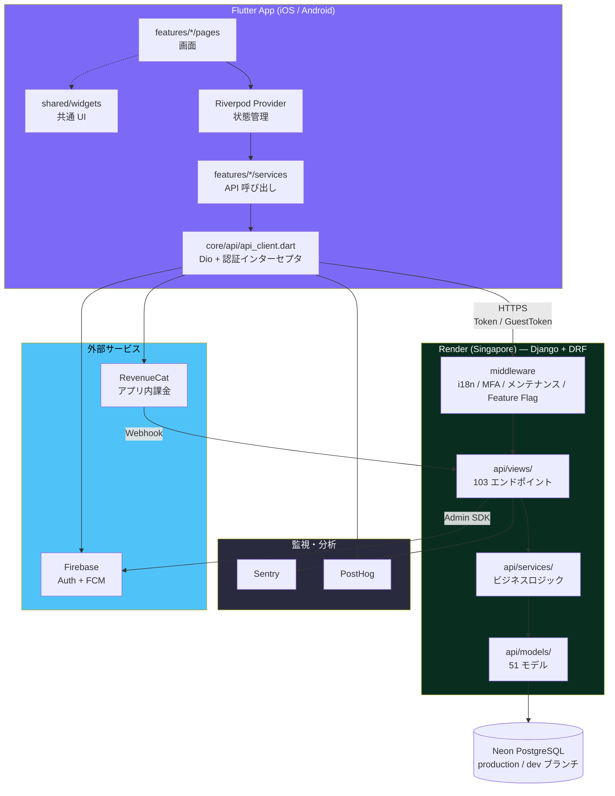
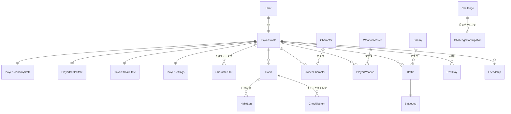
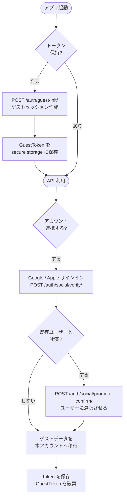
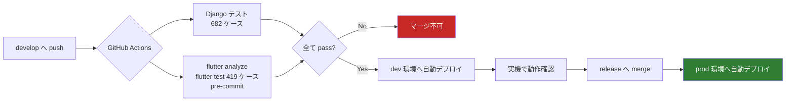

# Sabiowl — アーキテクチャ

> 最終更新: 2026-08-06（§2.3 の実測値を再測定 + 初版の集計漏れを訂正）
> 対象読者: 本プロジェクトのコードを初めて読む人
> 関連: [DESIGN_DECISIONS.md](DESIGN_DECISIONS.md)（なぜその設計にしたか） / [AI_WORKFLOW.md](AI_WORKFLOW.md)（開発プロセス）

---

## 1. 全体構成



### 環境の分離

| | production | dev |
|---|---|---|
| Backend | `sabiowl-backend.onrender.com` | `sabiowl-backend-dev.onrender.com` |
| DB | Neon `production` ブランチ | Neon `dev` ブランチ（prod のスナップショット） |
| デプロイ元 | `release` ブランチ | `develop` ブランチ |
| 外部サービス | 本番 Firebase / PostHog / RevenueCat | **すべて別プロジェクトに完全分離** |

デプロイの流れ: `develop` push → dev 自動デプロイ → 実機確認 → `release` へ merge → prod 自動デプロイ。

Neon の **DB ブランチ機能**により、本番のスナップショットから dev 用 DB を切り出しています。「本番と同じデータ形状で破壊的な検証ができる」ことがマイグレーション作業の安全性を大きく上げました。

---

## 2. バックエンドのレイヤ設計

### 2.1 なぜ分割したか

Django は初期速度が速い代わりに、`views.py` と `models.py` が単調増加して**数千行の神ファイル**になりがちです。本プロジェクトでも初期は単一ファイル構成でしたが、機能追加に伴いドメイン別ディレクトリ + サービス層へ**移行を進めています**。

```
backend/api/
├── views/            # HTTP 境界
│   ├── auth/         # ソーシャルログイン / ゲスト
│   ├── battle/       # 戦闘開始・終了
│   ├── calendar/
│   ├── habits.py  gacha.py  shop.py  social.py  player.py ...
│   ├── _error_helpers.py   # エラーレスポンス生成の統一
│   └── mixins.py
├── services/         # ビジネスロジック / トランザクション境界
├── models/           # ドメイン別モデル（51 モデル）
├── middleware/       # i18n / 管理画面 MFA / メンテナンス
├── migrations/       # 200 本
├── tests/            # 102 ファイル / 682 ケース
├── constants.py      # ゲームバランス定数
└── serializers.py
```

### 2.2 各層の責務（設計意図）

| 層 | やること | やらないこと |
|---|---|---|
| **views/** | リクエスト検証 → service 呼び出し → レスポンス整形 | ビジネスルールの判断、複数モデルにまたがる更新 |
| **services/** | ビジネスロジック、**トランザクション境界**、冪等性の担保 | HTTP に依存する処理（`request` を受け取らない） |
| **models/** | データ構造、フィールドレベルの制約、単純な導出プロパティ | 外部 API 呼び出し、複雑なワークフロー |

### 2.3 現状の到達点 — 意図と実装の乖離（実測 2026-08-06）

> **上の表は「目指している姿」であり、コードベース全体には行き渡っていません。**
> ここを曖昧にすると設計文書が実態と乖離するため、実測値を明示します。

| 指標 | 実測 | 2026-08-04 時点 |
|---|---|---|
| `views/` のファイル数 | 38 | 37 |
| うち `services/` を import しているファイル | **16（42%）** | 15（41%）|
| Python 関数の平均行数 | 26.0 行 | 26.5 行 |
| 80 行超の関数 | **40 個 / 512 個（7.8%）** | 39 個 / 494 個（7.9%）|
| 最大の view メソッド | `views/shop.py` の `post()` — **306 行** | `views/battle/finish.py` の `post()` — 426 行 |

**主要な view の行数**:

| 関数 | 行数 | 2026-08-04 |
|---|---:|---:|
| `views/shop.py` `post()` | 306 | 297 |
| `views/battle/start.py` `post()` | 268 | 268 |
| `views/battle/finish.py` `post()` | **256** | 426 |
| `views/auth/social.py` `post()` | 232 | 232 |
| `views/home.py` `get()` | 217 | 217 |

つまり **ドメイン別のファイル分割は完了しているが、view → service へのロジック移譲は道半ば**です。ショップ購入・バトル開始・ソーシャル認証といった**最も複雑な経路ほど view に残っています**。これは偶然ではなく、「複雑だから切り出しにくい」という順序で残った結果です。

#### 🔴 訂正: 2026-08-04 版の「12 ファイル（32%）」は誤りだった

初版は `services/` の利用率を **12 ファイル（32%）** と記載していました。同じ commit
（`e0fe9af0`）を AST で数え直すと **15 ファイル（41%）** で、**実態より 9pt 厳しい数字**を
書いていたことになります。

原因は grep のパターンが狭く、相対 import（`from ..services.x import y`）の一部を
拾えていなかったことです。トップレベルの `views/*.py` のみに絞っても 11/26 で 12 に
一致しないため、単なる集計漏れと判断しました。

再測定は AST の `ImportFrom` / `Import` ノードを走査する方式に変えています
（文字列パターンではなく構文木を見るので、書き方の揺れに影響されません）。
これは CLAUDE.md の「人の grep を信頼せず、不変条件はテストで縛る」と同じ話です。

#### 進捗: `battle/finish.py` の service 抽出（2026-08-05、`ca10e86c`）

前版で優先度 1 に挙げていた項目が実施されました。

| | Before | After |
|---|---:|---:|
| `finish.py` 全体 | 531 行 | **367 行** |
| `post()` メソッド | 426 行 | **256 行**（-40%）|

`services/battle_finish_service.py`（183 行）と `battle/_serializers.py`（236 行）へ
切り出されています。抽出した先の行数が削減幅を上回るのは、docstring と型注釈が
追加されたためです。同時に `test_battle_finish_validation_contract.py`（365 行）が
追加されており、**抽出前後の契約が固定されています**。

結果として最大の view メソッドは `shop.py` の `post()`（306 行）に移りました。

#### 入力バリデーションが DRF Serializer に乗っていない

| 指標 | 実測（2026-08-06） | 2026-08-04 |
|---|---:|---:|
| Serializer の定義数 | 16 | 14 |
| views での Serializer 使用箇所 | 54 | 52 |
| **うち `is_valid()` による入力検証** | **6** | 5 |
| 手動の `data.get()` パース | **47** | 50 |
| `error_response()` の呼び出し箇所 | 149 | 153 |

Serializer は依然として**ほぼ出力（シリアライズ）専用**で、入力検証の大半は各 view で手書きされています。

ただし `battle/finish.py` は 2026-08-05 に解消されました。`post()` の内部に定義されていたバリデーション用クロージャ `_parse_used()` と `data.get()` × 9 の計 78 行が、`views/battle/_serializers.py` の `BattleFinishSerializer` へ移っています。移行前に characterization test 22 ケースを書いてから動かしており、**エラーコード・文言・検証順序・`int` coerce の非対称性まで現行のまま維持**されています。

`is_valid()` が 5 → 6 と 1 しか増えていないのはこのためで、**1 経路だけが移行済み**という状態です。

エラー返却が 149 箇所に散在している構図は変わっていません。エラー形式の統一（新形式への移行）に手間がかかっている根本原因はここにあります。

#### なぜこの状態を残しているか

短期的には**動作していて、テストで縛られている**（バトル系だけで 6 テストファイル / `test_battle_views.py` に 65 アサーション）ためです。リリース済みアプリの中核経路であり、「動いているものを構造のためだけに触る」リスクを取っていません。

ただしこれは**返済予定のある技術的負債**として認識しており、優先順位は次のとおりです。

| 優先 | 対象 | 理由 | 状態 |
|---|---|---|---|
| ~~1~~ | ~~`battle/finish.py` の `post()` を service へ抽出~~ | 最大かつ最も複雑だった | **✅ 2026-08-05 完了**（426 → 256 行）|
| 1 | `shop.py` の `post()`（306 行）を service へ抽出 | finish.py の完了により**最大の view メソッドになった**。累進価格・在庫・ダイヤ残高の検証が 1 メソッドに同居している | 🔴 未着手 |
| 2 | 主要エンドポイントの入力検証を Serializer へ移行 | エラー形式の統一とセットで効く。`finish.py` で前例ができたので、**同じ手順（characterization test → 抽出）を横展開できる** | 🟡 1/54 経路 |
| 3 | `admin.py`（1,878 行）の分割 | 単一ファイルとして最大 | 🔴 未着手 |

**優先度 1 の進め方は `finish.py` の前例をなぞるのが最短です。** あの抽出が安全だったのは、先に characterization test（22 ケース）で現行挙動を固定してから動かしたためです。行数を減らすこと自体が目的ではなく、**「変えていないことを証明できる状態」を作ってから動かす**のが要点でした。

#### 補足: 巨大 view の中身の質

行数は多いものの、**判断の記録は残されています**。たとえばチート対策では、

- 効果のない検査（クライアント偽装可能な `duration_sec` チェック）を**撤去した経緯と日付**がコメントに残っている
- 誤検知と実不正を切り分けるため、警告ログに実測比（`ratio`）を出力している
- ロック順序が明記されている（`PlayerProfile → Battle → PlayerItem 昇順`）
- 他デバイスとの race を事前に想定している

**構造は未整理だが、判断は記録されている**というのが現状の正確な説明です。

---

### 2.4 代表的なサービス

| サービス | 責務 |
|---|---|
| `exp_service.py` | EXP 計算と 6 軸ステータスへの按分 |
| `diamond_service.py` | 課金通貨の増減（冪等性担保） |
| `habit_slot_service.py` | Legendary 難易度スロットの解放条件計算 |
| `habit_count_service.py` | 習慣カウント処理（EXP / ストリーク / 実績を横断） |
| `challenge_reward_service.py` | 月次チャレンジの報酬配布（tier 別の冪等フラグ） |

### 2.5 ミドルウェアスタック

標準の Django ミドルウェアに加えて、独自に 3 つ追加しています。

| ミドルウェア | 役割 | 配置上の制約 |
|---|---|---|
| `I18nMiddleware` | `Accept-Language` とユーザー設定から `request.locale` を確定 | 認証の後（ユーザー設定を読むため） |
| `AdminMFARequiredMiddleware` | 管理画面への OTP 二要素認証を強制 | `AuthenticationMiddleware` の**後**（`request.user.is_staff` を参照） |
| `MaintenanceMiddleware` | 緊急メンテナンス時に全 API を停止 | 末尾（他の処理を通した上で最終判断） |

加えて `waffle` による Feature Flag、`GZipMiddleware` による全レスポンス圧縮（30-70% 削減）を有効化しています。

---

## 3. データモデル

51 モデルのうち、中核となる部分の関係です。



### 3.1 PlayerProfile の 4 分割

初期の `PlayerProfile` は 30 以上のフィールドを持ち、**経済・戦闘・ストリーク・設定が混在**していました。アーキテクチャレビューで指摘を受け、4 モデルに分離しています。

```
PlayerProfile          基本情報（user / name / friend_id / active_character）
├── PlayerEconomyState 経済系（diamonds / coins / チケット類）
├── PlayerBattleState  戦闘系（level / exp / battle_charges）
├── PlayerStreakState  ストリーク系（streak / login / 日次カウンタ）
└── PlayerSettings     設定系（all_private / week_start_day）
```

**この分割は一度のマイグレーションでは行っていません。** 稼働中の本番 DB を壊さないため、次の段階に分けました。

1. **Phase 2a** — 4 モデルを `CreateModel` で追加（既存フィールドはそのまま）
2. **Phase 2b** — データをバックフィルし、両方に書き込む期間を設ける
3. **Phase 2c** — 読み取りを新モデルに切り替え、dev 環境で破壊的検証
4. **Phase 2d** — `PlayerProfile` 側の旧フィールドを `RemoveField`

移行期間中は `__getattr__` / `__setattr__` による**後方互換シム**を置き、既存コードが `player.diamonds` で読み書きできる状態を維持しました。シムは削除条件を明文化した上で、**別チケットとして削除タイミングを追跡**しています（暫定対応が恒久化するのを防ぐため）。

### 3.2 習慣 → ステータスへの変換

本アプリの中核となるデータフローです。習慣のカテゴリが 6 軸ステータスに按分されます。

| カテゴリ | 運動力 | 学習力 | 健康力 | 精神力 | 創造力 | 貢献力 |
|---|:---:|:---:|:---:|:---:|:---:|:---:|
| 運動 | 1.0 | | | | | |
| 体力 | 0.5 | | 0.5 | | | |
| 学習 | | 0.5 | | | 0.5 | |
| 仕事 | | 0.5 | | | | 0.5 |
| 休息 | | | 0.5 | 0.5 | | |
| 社交 | | | | | | 1.0 |
| その他 | 1/6 | 1/6 | 1/6 | 1/6 | 1/6 | 1/6 |

*（一部抜粋。全 11 カテゴリ）*

初期設計では 4 カテゴリに統一していましたが、**複数ステータスに寄与すべき習慣の EXP が片方に丸められて消える**問題があったため、比率による按分方式に変更しました。真実値は `backend/api/constants.py` の `CATEGORY_STAT_MAP`。

複数の `CharacterStat` を同時更新するため、**`select_for_update()` は必ず pk 昇順**で取得します（デッドロック防止）。

---

## 4. 認証

2 種類のユーザーを単一の仕組みで扱っています。



| 種別 | ヘッダー | 認証クラス |
|---|---|---|
| 通常ユーザー | `Authorization: Token <token>` | `ExpiringTokenAuthentication`（有効期限付き） |
| ゲスト | `Authorization: GuestToken <token>` | `GuestTokenAuthentication` |

**設計意図**: 「まず使わせて、価値を感じてから登録させる」ため、初回起動時にアカウント作成を要求しません。ただしゲストのままではデータを失うリスクがあるため、適切なタイミングで連携を促します。

ゲスト → 本アカウントへの昇格時に既存ユーザーと衝突するケースがあり、ここは本番で 500 エラーを踏んだ箇所です（詳細は [DESIGN_DECISIONS.md](DESIGN_DECISIONS.md) §トランザクション設計）。

### 認証不要エンドポイント（意図的な `AllowAny`）

`AllowAny` は誤設定だと重大な脆弱性になるため、**許可リストを文書で管理**し、リストにないものは自動修正の対象としています。

| エンドポイント | 理由 |
|---|---|
| `/api/` | Render ヘルスチェック |
| `/api/contact/` | 未認証でのお問い合わせ |
| `/api/auth/social/verify/` | サインインの入口 |
| `/api/auth/social/promote-confirm/` | 昇格時の衝突確認 |
| `/api/auth/guest-init/` | ゲストセッション作成 |
| `/api/auth/dev-login/` | **`DEBUG=True` 時のみ**有効 |
| `/api/iap/webhook/` | RevenueCat webhook（独自のヘッダー認証） |
| `/api/maintenance/` | メンテナンス告知（未認証でも全員に届ける必要） |

---

## 5. Flutter 側の構成

```
mobile/lib/
├── main.dart
├── core/
│   ├── api/
│   │   ├── api_client.dart        # Dio + 認証インターセプタ
│   │   └── dio_error_helper.dart  # エラー → ユーザー向け文言の変換
│   ├── router/app_router.dart     # GoRouter（40+ ルート）
│   ├── services/                  # FCM 等の横断サービス
│   └── theme/app_theme.dart
├── features/                      # 機能単位（feature-first）
│   ├── habits/  gamification/  calendar/  social/
│   ├── guild/   challenge/     settings/  auth/ ...
│   │   ├── models/     # freezed によるイミュータブルモデル
│   │   ├── services/   # API 呼び出し
│   │   ├── providers/  # Riverpod
│   │   └── pages/      # 画面
├── shared/widgets/                # 共通 UI
└── l10n/                          # ja / en（ARB）
```

### 状態管理の方針

| 用途 | 使うもの |
|---|---|
| サービス等の単純な値提供 | `Provider<T>` |
| 非同期の読み取り専用 | `FutureProvider.autoDispose<T>` |
| 非同期 + 操作 | `StateNotifierProvider` |
| ID 指定 | `.family` |

新規 feature は `@riverpod` アノテーション（コード生成）を採用しています。既存の手動 Provider 実装は、**動いているものを触るリスクの方が大きい**と判断して移行していません。この判断は規約として明文化し、「なんとなく古い書き方が残っている」状態と区別できるようにしています。

### ルーティング

`ShellRoute` でボトムナビゲーションを持つ画面群を囲い、それ以外はフルスクリーンで定義しています。

> **注意点**: 固定パス（`/friends/add`）は動的パス（`/friends/:playerId`）より**前**に定義する必要があります。順序を誤ると `add` が `playerId` として解釈されます。

### 現状の到達点 — Widget 分割の不足（実測 2026-08-04）

feature 単位のディレクトリ構成は 17 feature でほぼ統一されており、状態管理も Riverpod が支配的です（`ConsumerWidget` / `ConsumerStatefulWidget` 192 に対し、素の `StatefulWidget` は 38）。

一方で、**`build()` メソッドの分割は不足しています**。

| 指標 | 実測 |
|---|---:|
| 150 行を超える `build()` | **37 件** |
| 最大 | `features/gamification/pages/character_page.dart` — **423 行** |
| 2 番目 | `features/timeline/pages/add_event_page.dart` — 405 行 |
| 3 番目 | `features/calendar/widgets/quick_add_task_sheet.dart` — 366 行 |

Flutter では巨大な `build()` は可読性だけの問題ではなく、**分割していれば再構築されない部分まで再構築される**ためフレーム落ちの原因になります。本プロジェクトは意思決定の優先順位で「動作の軽さ」を最上位に置いているため、**自ら定めた基準に対する未達**という位置づけです。

#### テストの偏り

| 種別 | 件数 |
|---|---:|
| unit test | 321 |
| **widget test** | **68** |
| 画面（`*_page.dart`） | 41 |

ロジックは十分に縛られていますが、**UI の回帰は widget test 68 件（テストファイル 15）でしか守られていません**。画面数 41 に対して薄く、UI 変更時の安全網としては不十分です。

いずれも認識済みの負債であり、対応の優先順位は「巨大 `build()` の分割 → 主要画面への widget test 追加」の順としています。

---

## 6. CI / デプロイ



すべての job が **fatal**（`continue-on-error` なし）です。`flutter analyze` のみ `--no-fatal-infos` で info レベルの指摘を許容していますが、warning / error は失敗扱いになります。

Backend テストは **PostgreSQL 上で実行**しています。ローカル開発は SQLite にフォールバックする構成のため、トランザクションの aborted 状態のような **PostgreSQL 固有の挙動をローカルでは再現できない**ためです。

> **未解消の差異**: CI の Python は `3.12`（[ci.yml](../.github/workflows/ci.yml)）ですが、本番 Render は `3.14.3`（[runtime.txt](../backend/runtime.txt)）です。**本番と異なる処理系でテストしている**状態であり、揃えるべき箇所として認識しています。依存パッケージの互換性検証が必要なため未着手です。

iOS のビルドと TestFlight 配信は Codemagic で自動化しています。

---

## 7. マイグレーション運用

200 本のマイグレーションを稼働中の本番 DB に適用してきた中で確立したルールです。

| ルール | 理由 |
|---|---|
| **破壊的データ操作を `RunPython` に書かない** | マイグレーションは巻き戻せない。削除や大量更新は management command で明示的に実行する |
| **例外条項を 3 条件で定義** | 「禁止」だけでは master data 投入が回らないため、（master data のみ / FK 網羅 / 冪等性）を満たす場合に限り許容 |
| **実行前に接続先 DB を目視確認** | ローカルから本番 DB へ誤って `migrate` した事故があったため、確認スクリプトを経由する |
| **モデル分割時はシムの削除条件を明文化** | 暫定対応が恒久化しないよう、別チケットで削除タイミングを追跡 |

---

## 8. 参考

- [DESIGN_DECISIONS.md](DESIGN_DECISIONS.md) — 個々の設計判断の背景と結果
- [AI_WORKFLOW.md](AI_WORKFLOW.md) — AI を統制する開発プロセス
- [claude/migration_playbook.md](claude/migration_playbook.md) — マイグレーション運用の詳細
- [claude/backend_patterns.md](claude/backend_patterns.md) — Django 実装パターンと落とし穴
- [claude/flutter_pitfalls.md](claude/flutter_pitfalls.md) — Flutter 実装の落とし穴
