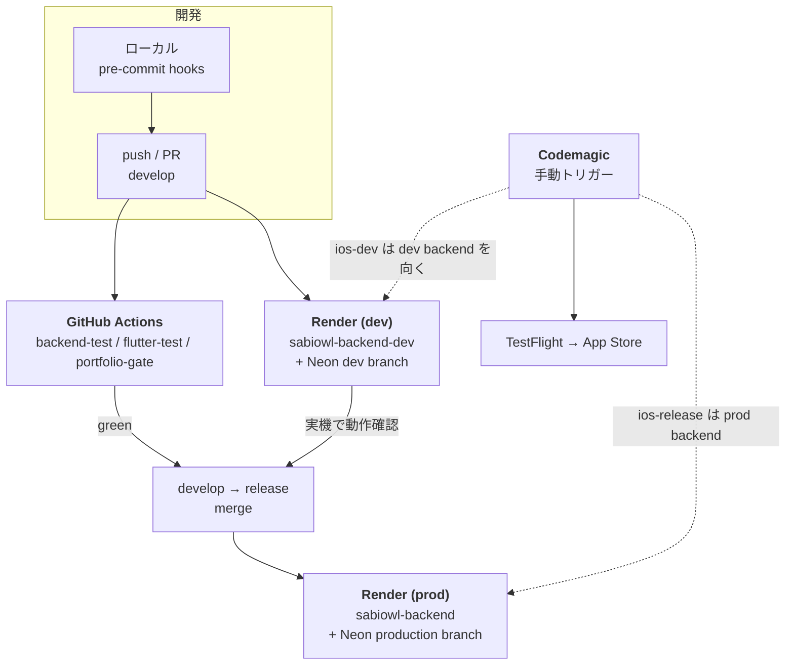

# Sabiowl の CI / CD

> 最終確認日: 2026-08-10（リポジトリの実設定を読んで記述。推定や計画ではなく現状の実態）
>
> 対象読者: このプロジェクトの外にいる人（レビュアー / 採用担当 / 共同開発者）

Sabiowl は Django バックエンドと Flutter モバイルアプリからなる monorepo です。
CI / CD は **3 つの独立したパイプライン** で構成されています。1 つのツールに寄せず分けているのは、
それぞれ制約が違うため（テストは Linux で速く回したい / Render はリポジトリ push を直接見る /
iOS ビルドには macOS + Apple の署名基盤が要る）です。

| # | パイプライン | ツール | 役割 | 起動契機 |
|---|---|---|---|---|
| 1 | **CI（検証）** | GitHub Actions | テスト・静的解析・秘密走査 | PR（→ develop / main）、push（develop） |
| 2 | **バックエンド CD** | Render | Django のビルド + マイグレーション + 配信 | push（develop → dev 環境 / release → 本番） |
| 3 | **モバイル CD** | Codemagic | iOS の署名・ビルド・TestFlight 配信 | **手動トリガー**（自動ビルドは設定していない） |

---

## 1. 全体像

### ブランチ運用

| ブランチ | 役割 | 自動で起きること |
|---|---|---|
| `develop` | 開発の主軸 | CI 実行 + **dev 環境へ自動デプロイ** |
| `release` | 本番リリース | **本番環境へ自動デプロイ** |
| `main` | 安定版（release と同期） | PR を出せば CI は走る |

本番へ出す手順は `develop` に積む → CI が green → dev 環境の実機で確認 → `release` に merge、の一方向です。
`release` への直接 push は運用ルールで禁止しています。

---

## 2. CI — GitHub Actions

設定は [`.github/workflows/ci.yml`](../.github/workflows/ci.yml) の 1 ファイルに集約。
3 つの job が並列で走り、所要は 5〜8 分です（各 job に 15 分の timeout を置き、ハングを検知します）。

### 2-1. `backend-test` — Django テスト

- サービスコンテナで **PostgreSQL 15** を立て、本番と同じ RDBMS でテストする（ローカルは SQLite fallback）
- **Python のバージョンは `backend/runtime.txt` から導出**する。ここは以前 `3.12` をハードコードしていて、
  本番（Render が `runtime.txt` を読む）が `3.14.3` で動いているのに CI だけ 2 マイナー古い、という状態でした。
  3.13 の標準ライブラリ削除（PEP 594）や 3.14 の遅延アノテーション（PEP 649）に起因する非互換は
  **CI を素通りして Render のビルドか本番の 500 で初めて表面化する**ため、単一の真実値から引くように直しています。
  実際この修正の直後に、`Pillow` が cp314 wheel を持たずソースビルドに落ちていた（本番だけが毎回 46MB を
  コンパイルしていた）ことが露見しました
- テストは **strict**。1 件でも落ちれば job が落ちます。仕様判断待ちのものは `@expectedFailure` で明示管理し、
  「なんとなく落ちている」状態を残しません
- 規模: テストファイル 110 本 / 22,433 行 / 180 テストクラス、**758 tests**（2026-08-10 実測、skip 1 件）

### 2-2. カバレッジの扱い

`coverage run` でテストを包み、**閾値割れで job を落とす** ratchet 方式にしています。

- backend: 実測 73.64%（PostgreSQL / 701 tests、2026-08-07 時点）に対し、下限を **72%** に設定
- 到達点を誇るための数字ではなく、**下がったら気づくための数字**として運用する。余裕を持たせすぎると
  「下がっても気づかない帯」がその分残るため、実測の 1.64pt 下まで締めています
- Flutter 側は実測 14.21% で、**意図的に下限を置いていません**。意味のある閾値を置ける水準にまだなく、
  まず傾向を可視化する段階だと判断しています
- Flutter の `--coverage` は「どのテストからも import されないファイル」を lcov に書かない＝分母から消えるため、
  backend の数字と直接比較はできません（実測で lib/ 304 ファイル中 276 が計測対象、欠落 28）。この歪みは
  ドキュメント上で明示しています

カバレッジは PR の Step Summary に出し、`coverage.xml` / `lcov.info` を 14 日保持の artifact として残します。

### 2-3. `flutter-test` — テスト + 静的解析 + lint

- `flutter analyze --no-fatal-infos`（info は許容、warning / error は fatal）
- `flutter test`（テストファイル 80 本）
- **pre-commit hooks を CI からも実行**（`pre-commit run --all-files`）。ローカルの hook 導入は個人の環境に
  依存するので、CI 側で同じものを必ず通します。検出内容は「生の例外を UI に露出していないか」
  （`Text('$e')` や `$e.toString()` の直貼り）で、ユーザーに見せる文言をキャラクターの口調に統一する
  プロダクト方針を機械的に守らせるものです

### 2-4. テストコードの中身

バックエンドのテストは [`backend/api/tests/`](../backend/api/tests/) の 1 ディレクトリに集約しています。
180 テストクラスの内訳は `APITestCase` 80 / `TestCase` 93 / `TransactionTestCase` 2 / `SimpleTestCase` 2 で、
**半数近くが DRF のテストクライアントで実際に HTTP を叩き、ステータスコードとレスポンス本体を検証する**形式です。
無効化されているテストは実行時 skip 1 件のみで、「落ちたまま放置されているテスト」はありません。

種類は 2 つあります。

**① 機能テスト** — バトル / 習慣カウント / ガチャ / 課金 webhook など、機能単位。

**② 契約テスト（10 本ほど）** — 振る舞いではなく **横断的な不変条件** を縛るもので、
一部はソースコード自体を走査します。

| テスト | 縛っている不変条件 |
|---|---|
| `test_error_response_format.py` | `views/` 全体に旧形式のエラーレスポンスが 1 件も無いこと |
| `test_env_var_documentation.py` | 環境変数定義の三者一致（`settings.py` / `.env.example` / Blueprint） |
| `test_error_code_l10n_sync.py` | エラーコードと多言語文言の同期 |
| `test_posthog_on_commit_contract.py` | 外部 HTTP 呼び出しがトランザクション内から出ていないこと |

②が生まれた経緯が `test_error_response_format.py` の docstring に残っています。
ドキュメント上は「旧形式は 0 件」とされていたのに、実測すると **78 件残っていた**。
0 件に見えたのは旧形式がすべて改行を挟んで書かれていて、1 行の grep にヒットしなかったためです。
この誤りを根拠にモバイル側の旧 parser を先に削除していたら、78 経路のエラーが表示不能になっていました。
**人の grep を信じず、不変条件はテストで縛る** —— という判断がテストコードとして残っています。

またテストの docstring は、何を守るためのテストかを明記する方針にしています。たとえばガチャの
排出確率テストは、指示書で洗い出した想定失敗シナリオ（Pre-mortem）とテストメソッドを 1 対 1 で対応付け、
「表示した確率で実際に抽選される」ことが App Store Guideline 3.1.1 / 景表法の観点で最も重い、
という守るべき理由まで書いています。

### 2-5. `portfolio-gate` — 公開前の秘密走査

このリポジトリは private ですが、履歴を切り離した公開用スナップショットを別リポジトリに同期しています。
同期スクリプトの秘密走査部分だけを `--scan-only` で CI から呼び、**公開できない情報が混入した時点（＝該当 PR）で
止める**ようにしています。同期を実行するときにしか気づけないと、混入から発覚まで数週間空き、
その間のコミットを全部さかのぼることになるためです。

### 2-6. 「敷いた」のではなく「締めていった」

CI は最初から strict だったわけではありません。

| 時期 | 状態 |
|---|---|
| 2026-07-03 | 導入。`flutter analyze` は `continue-on-error: true`、baseline 13-15 issues を許容 |
| 2026-07-25 | 既存の壊れたテスト 121 件を 0 にした上で、**全 job を fatal 化** |
| 2026-08-06 | カバレッジ計測を追加、Python バージョンを本番と同期 |
| 2026-08-07 | カバレッジ下限を実測ベースに引き締め、公開ゲートを追加 |

`ci.yml` には、なぜその設定なのか・何を試して何が壊れたかがコメントとして残っています。
設定ファイルというより、判断の記録に近い形になっています。

---

## 3. バックエンド CD — Render

Render の Blueprint（`render.yaml`）＋ Dashboard で、**本番 / 開発の 2 環境を分離運用**しています。

| | 本番 (production) | 開発 (dev) |
|---|---|---|
| デプロイ元ブランチ | `release` | `develop` |
| DB | Neon（production branch） | Neon（dev branch、本番のスナップショット） |
| 外部サービス | Firebase / PostHog / RevenueCat | すべて **別インスタンス** |

dev 環境は Dashboard 手動設定で、意図的に `render.yaml` に含めていません（Blueprint は本番の記述に絞る）。

### デプロイ時に走る処理（`backend/build.sh`）

1. 依存インストール
2. `collectstatic`
3. **マイグレーション** — ここに一つ工夫があります。通常運用の接続は Neon の pooled 接続（PgBouncer 経由）ですが、
   PgBouncer の transaction mode では DDL や advisory lock が制約されるため、**マイグレーションのときだけ
   direct 接続に差し替えて**実行します
4. `showmigrations` で適用状況をログに残す

### 運用上のガード

- **Secret はリポジトリに置かない**。DB 接続文字列・メール API キー・Firebase のサービスアカウント JSON は
  Blueprint 上で `sync: false` とし、値は Dashboard 側にのみ存在します
- **ローカルの `.env` には `DATABASE_URL` を書かない**運用にしています（未設定なら SQLite に fallback）。
  本番の接続先が手元に残っていると、うっかりローカルから本番へマイグレーションを流す事故が起きうるためで、
  実際に一度起きた schema drift 事故の再発防止策です。合わせて、接続先 DB を強制的に目視表示してから
  実行する pre-flight スクリプトを用意し、本番の endpoint に対しては確認文字列のタイプ入力を必須にしています
- **環境変数の Save だけでは反映されない**。Render は gunicorn の worker が古い環境変数を保持するため、
  「Save して終わり」ではなく Manual Deploy まで実施して初めて完了、と定義しています

---

## 4. モバイル CD — Codemagic

iOS ビルドは macOS 環境と Apple の署名基盤が必要なため、Codemagic（`codemagic.yaml`）に分離しています。
ワークフローは 2 本、**どちらも手動トリガー**です（`triggering:` を書いていないので自動ビルドは発生しません）。

| ワークフロー | 用途 | 向き先 |
|---|---|---|
| `ios-release` | 本番リリース → TestFlight → App Store | 本番バックエンド |
| `ios-dev` | develop の実機確認 | **dev バックエンド**（`--dart-define=API_BASE_URL` で差し替え） |

`ios-dev` を分けたのは、`ios-release` が API のベース URL を渡さない＝クライアント側の既定値（本番）を
向くためです。開発中の Flutter を古い本番サーバーに繋ぐと「新しいクライアント × 古いサーバー」になり、
確認そのものが無意味になります。共通ステップは YAML anchor で共有し、2 本が drift しないようにしています。

### ビルド番号の採番

Apple の `CFBundleVersion` 重複でリリースが弾かれる事故が 2 回続いたため、採番ロジックを見直しています。

- 原因: Apple は Invalid 判定されたビルドも含めて番号を記憶するのに対し、App Store Connect API の
  「最新ビルド番号」は Valid なものしか返さない。Invalid ビルドが番号を消費したまま 0 を返すため、
  再ビルドで同じ番号が採番され、publishing が reject される
- 対策: **TestFlight の最新 / App Store Connect の最新 / Codemagic 内蔵カウンタの 3 つの max + 1** を採る。
  内蔵カウンタは実行ごとに必ず増えるので Apple 側 API の見落としに干渉されず、Apple 側を見ることで
  Codemagic の外で手動アップロードされたビルドにも追従できます

### 分析キーの注入

PostHog / RevenueCat / Sentry のキーは Codemagic の secure な環境変数グループから `--dart-define` で
ビルド時に注入します。`ios-dev` では PostHog と Sentry を**意図的に渡していません** — 開発中の実機確認が
本番の分析データを汚したり、開発中のクラッシュが本番の crash-free 率（次バージョンの開放条件に使う指標）を
濁したりしないためです。

---

## 5. 正直に書いておく現状の制約

第三者が読むときに誤解しないよう、「やっていないこと」も明示します。

| 項目 | 現状 | 理由 / 補い方 |
|---|---|---|
| `release` への push で CI が走らない | トリガーは PR（→ develop / main）と push（develop）のみ | `develop` で green を確認したコミットのみを merge する運用で担保。ただし**運用に依存した担保**であり、構造的なガードではない |
| iOS ビルドの自動トリガーなし | 手動起動 | ビルド時間とリリース判断のコストが理由。TestFlight 配信は意図的に人が起点になる |
| Android の CD 未整備 | `codemagic.yaml` にコメントアウトで骨子のみ | 現在 iOS のみリリースしているため |
| Flutter のカバレッジ下限なし | 実測 14.21%、閾値なし | 意味のある下限を置ける水準にない。数字だけ追ってガードを形骸化させない判断 |
| デプロイのロールバック | Render Dashboard から手動 | 自動ロールバックは未実装 |
| マイグレーションはデプロイ中に自動実行 | `build.sh` 内 | そのため破壊的なデータ操作をマイグレーションに含めることを禁止し、management command での明示実行に分けている |

---

## 6. 数値サマリ

| 指標 | 値 |
|---|---|
| CI 所要時間 | 5〜8 分（3 job 並列 / 各 15 分 timeout） |
| バックエンドテスト | 110 ファイル / 22,433 行 / 180 クラス / **758 tests**（skip 1 件） |
| バックエンドカバレッジ | 73.64%（下限 72% で fail） |
| Flutter テスト | 80 ファイル |
| Flutter カバレッジ | 14.21%（可視化のみ、下限なし） |
| バックエンド反映時間 | push → 本番反映まで約 10 分 |

### 主要バージョン

Python 3.14.3 / Django 6.0 / DRF 3.16 / Flutter 3.29.3 / PostgreSQL 15（CI）/ Neon（本番・dev）

---

## 関連ファイル

| ファイル | 内容 |
|---|---|
| [`.github/workflows/ci.yml`](../.github/workflows/ci.yml) | CI の全定義（設定の意図をコメントで併記） |
| [`.pre-commit-config.yaml`](../.pre-commit-config.yaml) | lint hooks（CI からも実行） |
| [`backend/build.sh`](../backend/build.sh) | Render のビルド手順 |
| [`backend/.coveragerc`](../backend/.coveragerc) | カバレッジ計測の対象と除外 |
| `render.yaml` | Render Blueprint（本番） |
| `codemagic.yaml` | iOS ビルド / TestFlight 配信 |
